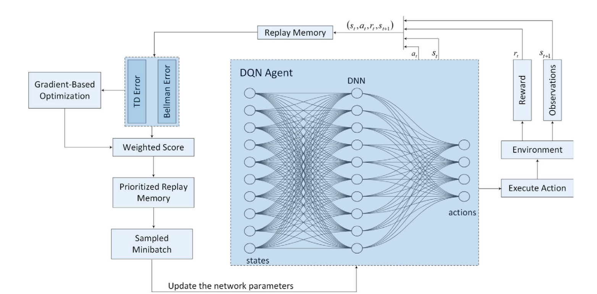

# adaptive-buffer-rl
 This repository presents an implementation of **Adaptive Prioritized Experience Replay** in Reinforcement Learning, based on the paper:

> **"Improved exploration–exploitation trade-off through adaptive prioritized experience replay"**  
> Hassani, Nikan, & Shami — *Neurocomputing, 2025*

The project provides a comparison between standard Deep Q-Learning (DQN) and an enhanced adaptive experience replay strategy that dynamically balances exploration and exploitation throughout the training process.
Includes configurable training pipelines, enhanced buffer prioritization, and end-to-end logging &amp; visualization.

---

## Key Idea

Traditional DQN agents sample past experiences from a replay buffer uniformly or with fixed priority based on TD error. This project implements an **adaptive buffer mechanism** that:

- Computes transition priority based on **both TD error and Bellman error (BE)**.
- **Dynamically adjusts** the weight between exploration (BE) and exploitation (TD error) during training.
- **Mitigates sampling bias** through importance sampling correction.
- Supports **multi-environment evaluation** (CartPole, MountainCar, Acrobot, LunarLander) via a flexible configuration system.

---

## Features

- **Modular configuration** — Switch environments easily by editing config files.
- **Supports standard DQN, PER, and Adaptive Buffer** methods.
- **Overtime reward information** - View and plot episode rewards over time
- **Fair comparisons** — All models trained under identical settings.
- **Notebook or python project** - The project can be used both through jupyter notebook using the main.ipynb file or through any python interpreter through main.py.

---

## Installation

```bash
git clone https://github.com/RyanWri/adaptive-buffer-rl.git
cd adaptive-buffer-rl
pip install -r requirements.txt
```

### Run Training:

```bash
python main.py
```

## Configuration

All training parameters are defined in `config.yaml`, which is structured into two main sections: `environments` and `parameters`.

### Environments

You can define multiple environments here, each with its own name and episode count:

```yaml
environments:
  cartpole:
    env_name: "CartPole-v1"
    episodes: 250

  mountaincar:
    env_name: "MountainCar-v0"
    episodes: 250

  acrobot:
    env_name: "Acrobot-v1"
    episodes: 500
```

### Parameters
Shared training parameters for all environments:

```yaml
parameters:
  learning_rate: 0.1
  batch_size: 64
  gamma: 0.9
```

## Architecture of the Adaptive Replay Method
The diagram below illustrates the architecture of the adaptive prioritized replay mechanism introduced in the project. Unlike standard DQN, this method computes a weighted score for each experience in the replay buffer by combining Temporal Difference (TD) error and Bellman Error. The weights are dynamically updated using a gradient-based optimization strategy to balance exploration and exploitation during training. This prioritization guides which transitions are sampled, allowing the agent to learn more efficiently from meaningful experiences.


